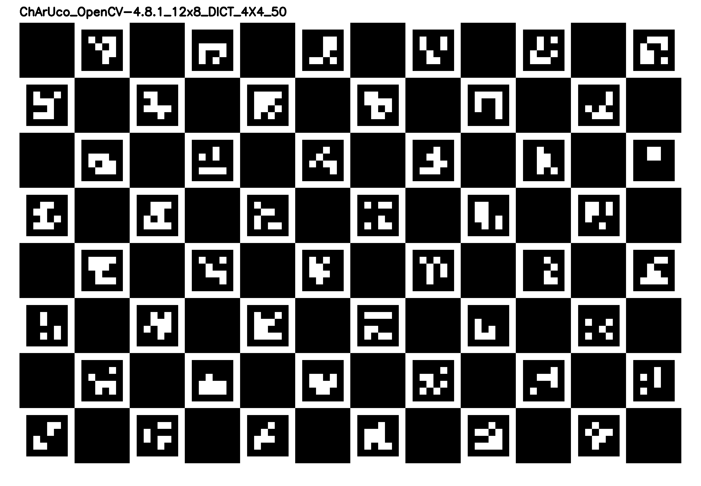

# ChArUco 位姿检测

该工程使用ChAruco标定板对相机内参进行标定,并且可以在任意角度(标定板出现大于5个ArUco二维码)检测出标定板在相机坐标系下的位姿

## 安装
Python版本为3.11
```bash
pip install -r requirements.txt
```

## 使用流程
### 没有标定板的情况下,可以生成并打印标定板
运行generate_calibration_board.py生成标定板,标定板的图片路径为`./calibration_board.png`.
也可以直接使用工程中的[calibration_board.png](./calibration_board.png)
```bash
python generate_calibration_board.py
```



### 相机内参标定
测量标定板中纯黑色正方形的边长,单位为米,将其填入[camera_calibration.py](./camera_calibration.py)中的`square_length`,即下面的`0.0024`.
```
board, aruco_dict, board_name = ChArUcoBoard(width=12, height=8, square_length=0.024)
```
从不同角度拍摄标定板,至少拍摄20张,图片格式为`png`,图片存放路径为`./image`.运行camera_calibration.py,
此时会显示标定图片,按下任意键切换下一张图片.
```
python camera_calibration.py
```
标定完成后命令行打印相机参数和畸变参数,同时参数也会保存在`./params/camera_params.yaml`.


### 使用标定参数估计相机位姿
运行detect_marker.py,读取相机内参信息,并识别要检测的图像中的标定板,在图像中画出坐标中(左上角为原点,右手坐标系)
并输出RPY的pose(程序中是将旋转矢量转换为欧拉角),检测出来的初始数据是旋转矢量,如果需要旋转矢量,可以选择rvec和tvec作为输出.

```
python detect_marker.py
```
